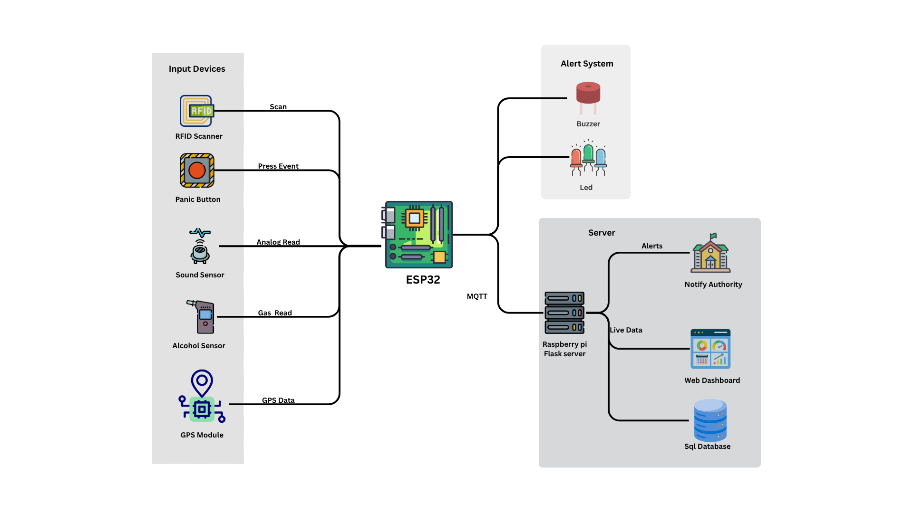
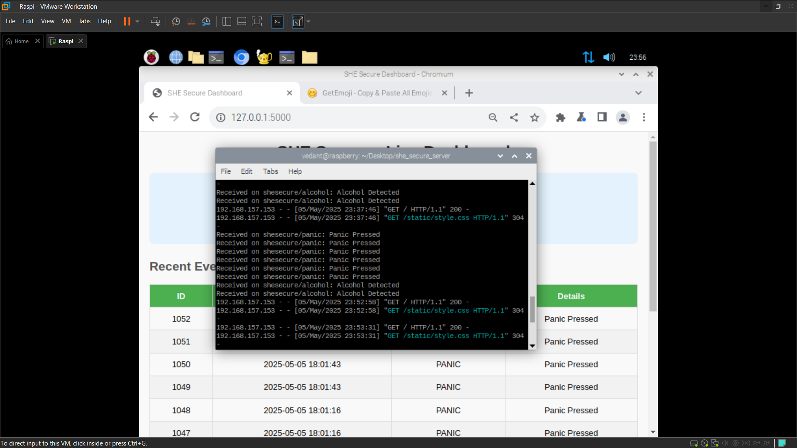

# SHE Secure: IoT Bus Safety System

**Author:** Vedant Baldwa
**Date:** April 2025  

---

## Overview

**SHE Secure** (“Safety, Help, Emergency”) is an end-to-end IoT solution designed to enhance women’s safety on college buses.  
It integrates:

- **ESP32-C6 edge nodes** (keypad entry, panic button, MQ-3 alcohol sensor, buzzer, LCD)  
- **MQTT broker** running on a Raspberry Pi (message routing)  
- **Python Flask + paho-MQTT + SQLite server** (authentication, logging, dashboard)  

This repository contains all firmware, server code, diagrams, and documentation needed to reproduce and extend SHE Secure.

---

## Table of Contents

- [Features](#features)  
- [Architecture](#architecture)  
- [Hardware Components](#hardware-components)  
- [Software Components](#software-components)   
- [Setup & Installation](#setup--installation)  
  - [1. Clone the Repository](#1-clone-the-repository)  
  - [2. Flash Firmware to ESP32](#2-flash-firmware-to-esp32)  
  - [3. Set Up the Raspberry Pi Server](#3-set-up-the-raspberry-pi-server)  
- [Usage](#usage)  
- [Screenshots & Diagrams](#screenshots--diagrams)  
- [License](#license)  

---

## Features

1. **Restricted Entry**  
   - Students enter a ID on a matrix keypad (later replace by a RFID reader/sensor).  
   - Node publishes to `shesecure/keypad_id` → Raspberry Pi verifies against an `authorized_students` table (UID, Name, Gender).  
   - Displays “Welcome <Name>” or “Unauthorized” on a 16×2 LCD.

2. **Panic Button**  
   - Panic button near each seat publishes to `shesecure/panic`.  
   - Server stores event, triggers a buzzer and dashboard alert.  
   - LCD shows “ALERT! PANIC” for 20 s.

3. **Alcohol Detection**  
   - MQ-3 sensor continuously reads analog values.  
   - If above threshold, publishes to `shesecure/alcohol`.  
   - Node blinks LED + shows “ALERT! ALCOHOL” on LCD for 20 s.  

4. **Noise Detection**  
   - High-pitched sound publishes to `shesecure/noise`.  
   - Server logs event and triggers alert similar to panic.

5. **Centralized Dashboard**  
   - Flask web server displays recent events, gender counts, and log controls.  
   - Supports sending custom messages to all bus LCDs via MQTT.

---

## Architecture



1. **Edge Nodes (ESP32-C6)**  
   - Node 1 handles keypad, panic button, MQ-3, LCD, buzzer, LED.  
   - Node 2 (if used) can handle additional sensors or functions.

2. **MQTT Broker (Mosquitto)**  
   - Runs on Raspberry Pi, listening on `localhost:1883`.  
   - Topics:  
     - `shesecure/keypad_id`  
     - `shesecure/panic`  
     - `shesecure/alcohol`  
     - `shesecure/noise`  
     - `shesecure/alerts`  
     - `shesecure/display_name`  
     - `shesecure/custom_lcd`

3. **Server (Raspberry Pi)**  
   - **server.py** runs a Flask app (HTTP) and a paho-MQTT client in a background thread.  
   - **SQLite** stores:  
     - `authorized_students(uid, name, gender)`  
     - `logs(id, timestamp, event_type, details)`  
   - De-duplicates events within 2 s.

4. **Dashboard (Browser)**  
   - User interface to view last 10 logs, reset counts, send custom LCD messages, and clear logs.

---

## Hardware Components

- **ESP32-C6 WROOM-1 DevKit** (×1 or ×2)  
- **MQ-3 Alcohol Sensor Module** (×1)  
- **4×4 Keypad Module** (×1)  
- **Panic Button Switch** (×1)  
- **16×2 I2C LCD Display** (×1)  
- **Active Buzzer Module (MH-5MD)** (×1)  
- **LED + 220 Ω Resistor** (×1)  
- **Jumper Wires, Breadboard, 3.3 V/5 V Supply**  
- **Raspberry Pi (3/4/5)** or any Linux machine  
  - Running **Mosquitto** (`sudo apt install mosquitto`)  
  - Python 3.9+, **Flask**, **paho-mqtt**, **sqlite3**  

---

## Software Components

1. **Arduino IDE** (with ESP32 board support)  
2. **Arduino Libraries**  
   - `Keypad` by Mark Stanley and Alexander Brevig  
   - `LiquidCrystal_I2C`  
   - `PubSubClient` (for MQTT)  
   - `WiFi.h` (built-in for ESP32)  

3. **Python** (≥ 3.9) on Raspberry Pi  
   - Packages in `server/requirements.txt`:  
     ```
     Flask==2.2.2
     paho-mqtt==1.6.1
     ```  

4. **Mosquitto MQTT Broker** (`sudo apt install mosquitto mosquitto-clients`)  


---

## ⚙️ Setup & Installation

### 1. Clone the Repository

```bash
git clone https://github.com/Vedant-Baldwa/she-secure-bus-iot.git
cd she-secure-bus-iot
```

---

### 2. Flash Firmware to ESP32

- Open Arduino IDE
- Install libraries:
  - `Keypad` by Mark Stanley, Alexander Brevig
  - `LiquidCrystal_I2C`
  - `PubSubClient`
- Select Board: **ESP32C6 Dev Module**
- Open `firmware/Node1.ino`
- Edit:
  - Replace `ssid`, `password` and `mqtt_server` with your actual WiFi and Raspberry Pi IP
  - Adjust pin numbers if needed
- Upload to ESP32-C6

---

### 3. Set Up the Raspberry Pi Server

```bash
sudo apt update
sudo apt install mosquitto mosquitto-clients python3-pip python3-venv
```

```bash
cd server
python3 -m venv venv
source venv/bin/activate
pip install -r requirements.txt
```

To initialize the database:
```bash
python3 -c "import server; server.init_db()"
```

To run the server:
```bash
python3 server.py
```

---
## 🚀 Usage

- Power on your Raspberry Pi and ESP32
- On browser, open:  
  `http://<your-pi-ip>:5000`
- **Enter ID** on keypad → if authorized, student name is displayed; if not, shows “Access Denied”
- **Panic Button Pressed** → triggers buzzer, logs to dashboard
- **Alcohol Detected** → logs alert, LED blinks, value is sent to ThingSpeak
- **Dashboard Options:**
  - Send custom LCD message
  - Clear LCD
  - Clear all logs
  - Reset gender counts

---

## 🖼️ Screenshots & Diagrams

- **System Architecture**

  

- **Image**

  

- **Web Dashboard**

  

---
## 📄 License

This project is licensed under the [MIT License](LICENSE)


